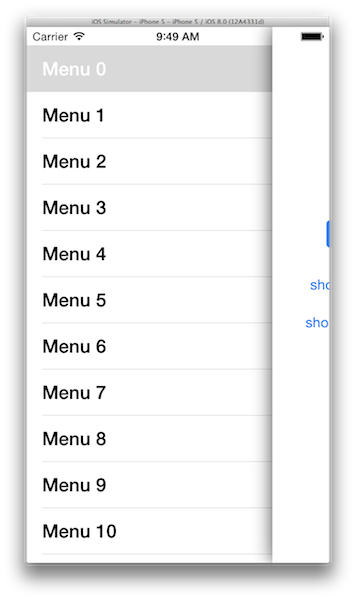
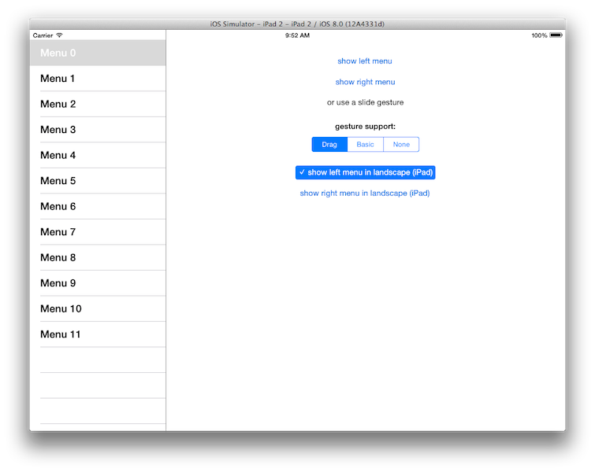

APLSlideMenu
=========

Sliding Hamburger Menu like the one in the Facebook App

* supports left and right slide menus
* supports optional swipe gesture support
* supports device orientations
* supports optional permanent display of slidemenu in landscape on iPad like an UISplitViewController
* supports iOS 7 View controller-based status bar appearance
* supports storyboard setup
* basic accessibility support

 

## Installation
Install via cocoapods by adding this to your Podfile:

	pod "APLSlideMenu"

## Usage
APLSlideMenuViewController should, but does not have to be rootViewController. It is initialized via Storyboard or with code in your AppDelegate or an APLSlideMenu subclass.

### Storyboard
Just drag custom segues like `APLSlideMenuContentSegue`, `APLSlideMenuLeftMenuSegue` or `APLSlideMenuRightMenuSegue` from your APLSlideMenuViewController to your content and menu view controllers and name the segue identifiers `content`, `leftMenu` or `rightMenu`.

If you are using an exception breakpoint and you are not using all three segues, the exception breakpoint will interrupt execution. To prevent this you might want to use a symbolic breakpoint instead. Use the symbol `objc_exception_throw` and the condition:

	(BOOL)(!(BOOL)[[(NSException *)$r0 reason] hasSuffix:@"has no segue with identifier 'leftMenu'"] && !(BOOL)[[(NSException *)$r0 reason] hasSuffix:@"has no segue with identifier 'rightMenu'"] && !(BOOL)[[(NSException *)$r0 reason] hasSuffix:@"has no segue with identifier 'content'"])

When testing with your simulator instead of a device, you need to deactivate this symbolic breakpoint and add another one, replacing every occurance of `$r0` with `$eax` in the condition.

### Code

Import header file:

	#import "APLSlideMenuViewController.h"
	
Initialization example:
	
	id rootViewController = self.window.rootViewController;
	
    if ([rootViewController isKindOfClass:[APLSlideMenuViewController class]]) {
        APLSlideMenuViewController *slideViewController = rootViewController;
        
        // first: configure the slide menu
        slideViewController.bouncing = YES;
        slideViewController.gestureSupport = APLSlideMenuGestureSupportDrag;
        
        // second: set the leftMenuViewController and / or rightMenuViewController
        slideViewController.leftMenuViewController = [MyLeftMenuViewController new];
        slideViewController.rightMenuViewController = [MyRightMenuViewController new];
        
        // third: set the contentViewController
        slideViewController.contentViewController = [MyContentViewController new];
        
    } else {
        NSLog(@"Ups, this shouldn't happen");
    }

## Migration from earlier versions

### From 0.0.x

* rename deprecated `menuViewController` property to `leftMenuViewController`
* rename deprecated `showMenu:` method calls to `showLeftMenu:`
* rename deprecated `switchMenu:` method calls to `switchLeftMenu:`
